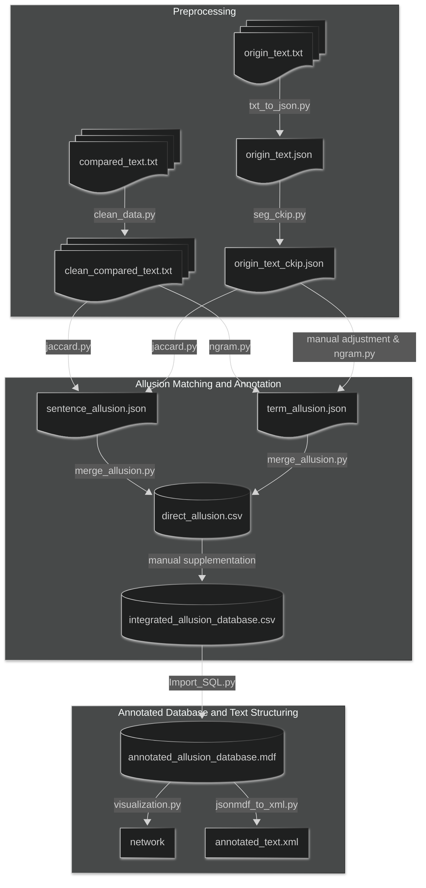

# zicai
A sample thesis repo showing the workflow and main contents of dissertation.

## Workflow

```mermaid
---
config:
  theme: dark
  look: neo
---
flowchart TD
  subgraph Preprocessing["Preprocessing"]
      B1["origin_text.json"]
      B2["origin_text_ckip.json"]
      A1["origin_text.txt"]
      A2["compared_text.txt"]
      A3["clean_compared_text.txt"]
  end
  subgraph subGraph1["Allusion Matching and Annotation"]
      C1["sentence_allusion.json"]
      C2["term_allusion.json"]
      D1[("direct_allusion.csv")]
      E1[("integrated_allusion_database.csv")]
  end
  subgraph subGraph2["Annotated Database and Text Structuring"]
      E2[("annotated_allusion_database.mdf")]
      F1["network"]
      F2["annotated_text.xml"]
  end
    A1 -- "txt_to_json.py" --> B1
    A2 -- "clean_data.py" --> A3
    A3 -- "jaccard.py" --> C1
    A3 -- "ngram.py" --> C2
    B1 -- "seg_ckip.py" --> B2
    B2 -- "jaccard.py" --> C1
    C1 -- "merge_allusion.py" --> D1
    B2 -- "manual adjustment & ngram.py" --> C2
    C2 -- "merge_allusion.py" --> D1
    D1 -- "manual supplementation" --> E1
    E1 -- "Import_SQL.py" --> E2
    E2 -- "visualization.py" --> F1
    E2 -- "jsonmdf_to_xml.py" --> F2

    %% 文件icon
    A1@{ shape: docs}
    A2@{ shape: docs}
    A3@{ shape: docs}
    B1@{ shape: doc}
    B2@{ shape: doc}
    C1@{ shape: doc}
    C2@{ shape: doc}
```
